# Wazuh SOC Home Lab: Zero-to-Hero Deployment & Optimization


## 📌 Overview

This repository provides a comprehensive, step-by-step guide for deploying a **Wazuh Security Operations Center (SOC)** using the official OVA.

This guide is designed for beginners and students building their first home lab. It specifically addresses the hidden hurdles of virtualized networking, SSL browser warnings, and the critical resource optimizations required to run enterprise security tools on computers with limited RAM (4GB–8GB).

---

## ⚙️ Phase 1: Hypervisor Network Setup (Crucial First Step)

Before booting the downloaded Wazuh OVA, you must fix the virtual network. By default, both VirtualBox and VMware set new VMs to **NAT**. In NAT mode, your VM can access the internet, but your Windows host computer *cannot* reach the VM to view the dashboard.

### VirtualBox

**1. Change the Network Adapter:**

1. Open VirtualBox, right-click your Wazuh VM, and select **Settings**.
2. Navigate to the **Network** tab.
3. Change "Attached to:" from **NAT** to **Bridged Adapter**.
4. Click **OK**.


### VMware Workstation / VMware Player

**1. Change the Network Adapter:**

1. Open VMware, right-click your Wazuh VM, and select **Settings**.
2. Select the **Network Adapter** entry.
3. Change the network connection from **NAT** to **Bridged Adapter**.
4. Click **OK**.

> 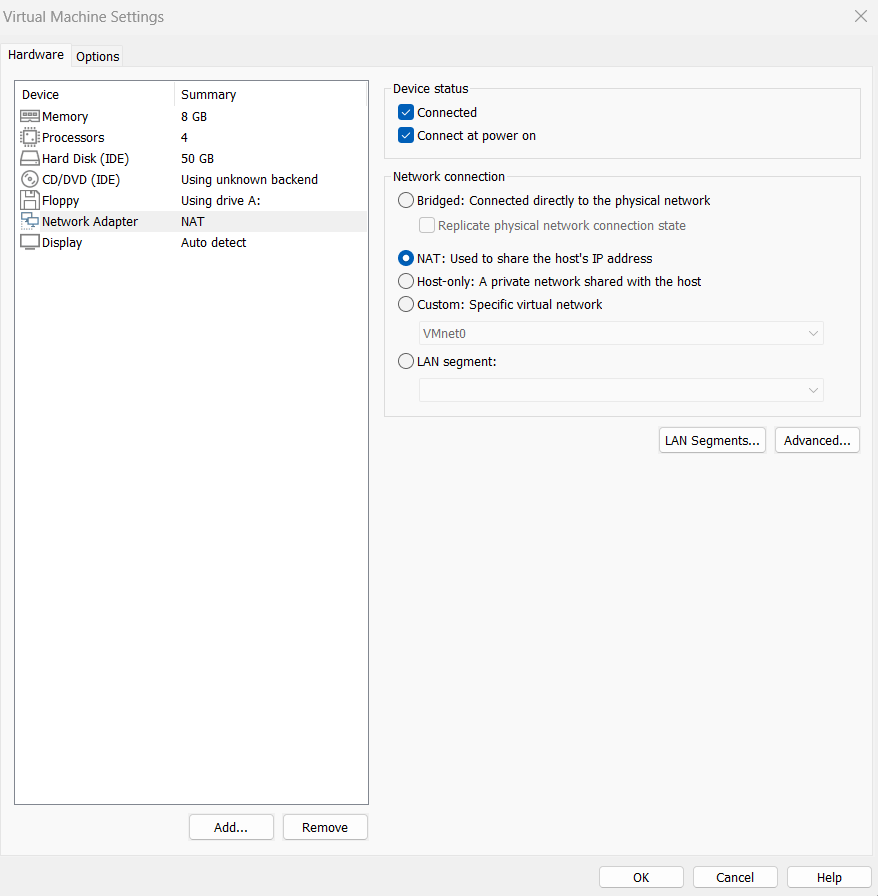
>


*(This allows the VM to connect directly to your home router and get a reachable IP address).*

---

## 🔍 Phase 2: Booting & Network Discovery

Start your VM. Once it finishes booting to the black terminal screen, follow these steps to find its address.

**1. Log into the Virtual Machine:**

- **Username:** `wazuh-user`
- **Password:** `wazuh`

**2. Discover the VM's IP Address:**

You need this IP to access the web dashboard and connect your endpoints.

```bash
ip a
```

Look for the `inet` address under the `eth0` or `enp0s3` interface (e.g., `192.168.5.135`). Write this down.


> 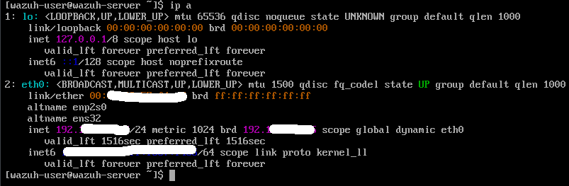

---

## 🌐 Phase 3: Accessing the Dashboard & The SSL Warning

Open Chrome or Edge on your Windows computer and type `https://<YOUR_VM_IP>`.

### The "Scary" Browser Warning

You will immediately hit a red screen stating **"Your connection is not private."** Do not panic—you haven't been hacked. This happens because Wazuh uses a **self-signed lab certificate** rather than a paid, public web certificate.

1. Click the **Advanced** button.
2. Click **Proceed to [IP Address] (unsafe)**.


>
> 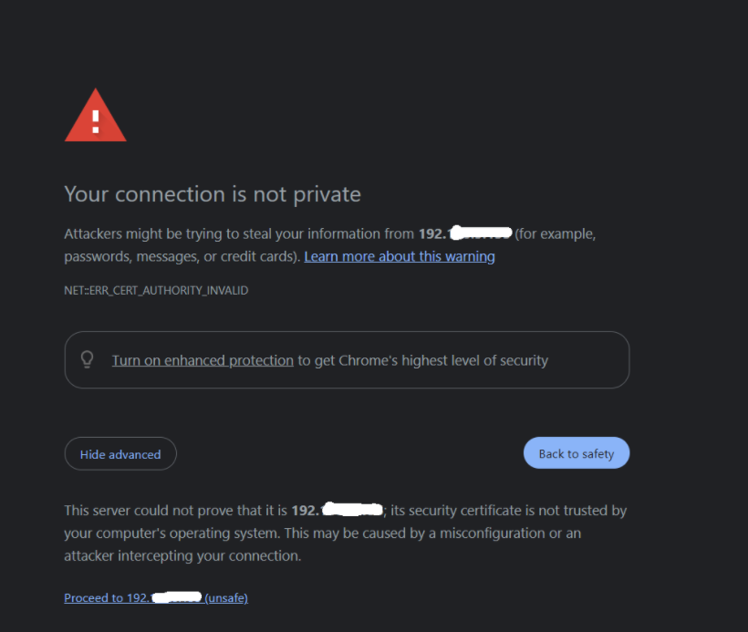

- **If the page loads the Blue Wazuh Login Screen:** Log in with `admin` / `admin`. You are done! **Skip to Phase 6.**


> 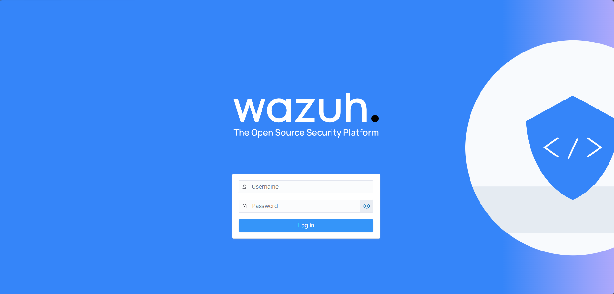

- **If the page says "Wazuh dashboard server is not ready yet":** Proceed to Phase 4.


>
> 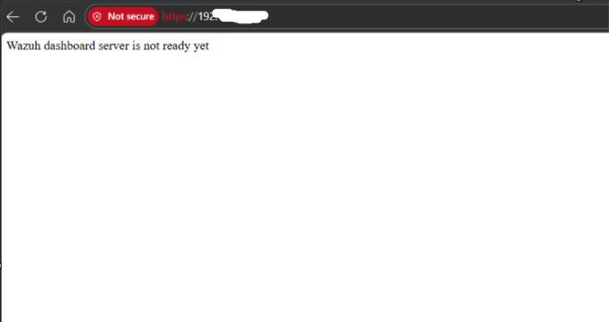

---

## 🛠️ Phase 4: Fixing Boot Failures & Optimizing Memory

If the dashboard refuses to load, the backend database (Wazuh Indexer) ran out of memory and crashed. By default, Wazuh tries to claim **4GB of RAM**. If your VM only has 4GB–8GB total, Linux will violently kill the database.

### The Linux Terminal Survival Guide (`nano`)

We will use a text editor called `nano`. To save and exit a file in `nano`, always use this exact keyboard sequence:

1. Press `Ctrl + O` (the letter O) to save.
2. Press `Enter` to confirm the file name.
3. Press `Ctrl + X` to exit.

### Fix 1: Restrict Java Heap Memory to 1GB

We must force the database to operate within a smaller memory footprint.

**1. Open the configuration file:**

```bash
sudo nano /etc/wazuh-indexer/jvm.options
```

**2. Modify the Heap Values:**

Scroll down past the lines starting with `##`. Locate the active lines (usually `-Xms4g` and `-Xmx4g` or `-Xms3972m`) and change them to exactly **1 Gigabyte**:

```
-Xms1g
-Xmx1g
```


> 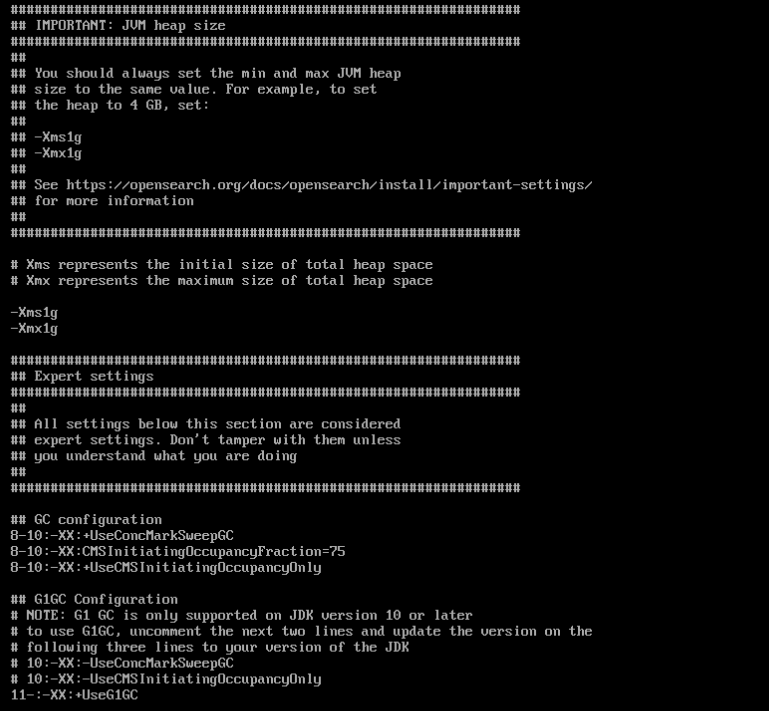

Save and exit using the sequence above.

### Fix 2: Extend Startup Timeouts

Because local VMs have slower hard drives, the database takes longer to start. We need to give it **20 minutes** instead of the default 90 seconds.

**1. Open the Timeout Override File:**

```bash
sudo nano /etc/systemd/system/wazuh-indexer.service.d/startup-timeout.conf
```

**2. Inject the Timeout Rule:**

```ini
[Service]
TimeoutStartSec=1200
```


> 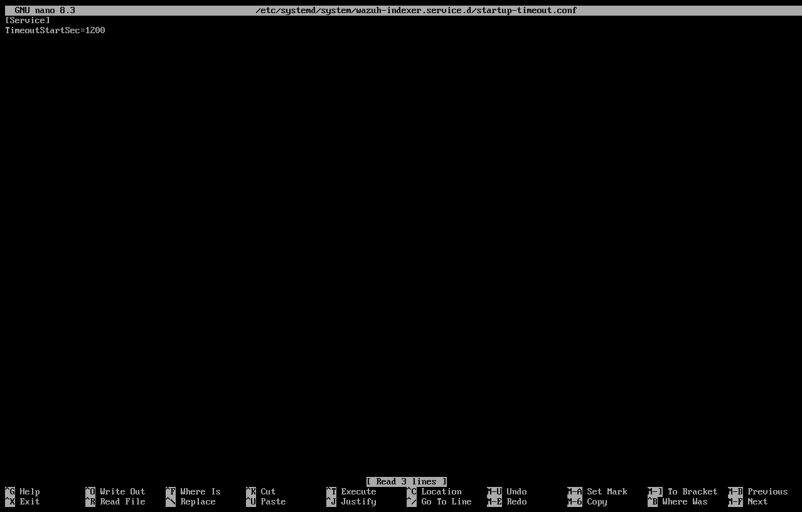

Save and exit.

**3. Apply the System Rules:**

```bash
sudo systemctl daemon-reload
```

---

## 🎛️ Phase 5: Clean Boot & Service Automation

After a crash, zombie processes are left behind. The cleanest way to apply your new fixes is to configure the services to start automatically, then perform a full system reboot.

### Automating Service Startup

Ensure the core components automatically turn on whenever you boot the VM:

```bash
sudo systemctl enable wazuh-indexer
sudo systemctl enable wazuh-manager
sudo systemctl enable wazuh-dashboard
```

### The System Reboot

```bash
sudo reboot
```

### The Golden Rule of Wazuh Services

If you ever need to manually restart the platform, **always start the database (indexer) first**, wait 2 minutes, and then start the manager and dashboard.

**Manual Start Commands:**

```bash
sudo systemctl start wazuh-indexer
sudo ss -tulpn | grep 9200       # Wait until you see port 9200 "LISTEN"
sudo systemctl start wazuh-manager
sudo systemctl start wazuh-dashboard
```


> 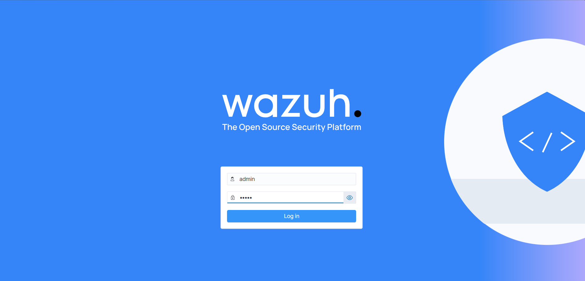
Navigate back to `https://<YOUR_VM_IP>` and log in with credentials username: admin and password: admin


> 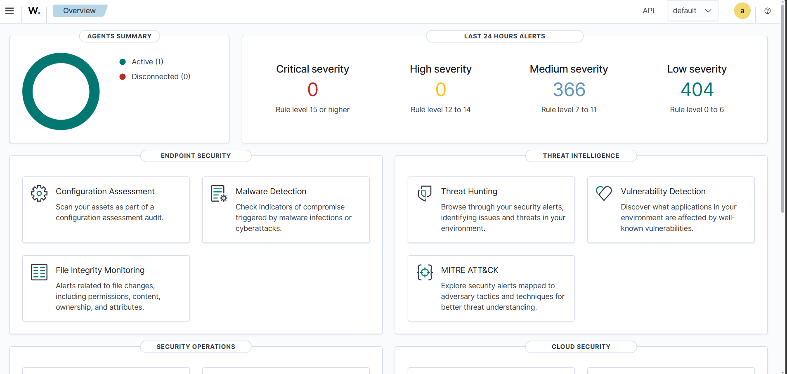

---

## 🛡️ Phase 6: Windows Endpoint Deployment

To monitor your Windows machine and pull its security logs, you must install the **Wazuh Agent**.

### Step 1: The Ping Test

Before trying to install anything, ensure your Windows computer can actually communicate with the Linux VM.

1. Open the **Command Prompt** on Windows.
2. Type `ping <YOUR_VM_IP>`.
3. If you see **"Reply from..."**, the network is perfect. If it says **"Destination host unreachable,"** go back to Phase 1 and check your Bridged Adapter settings.


> 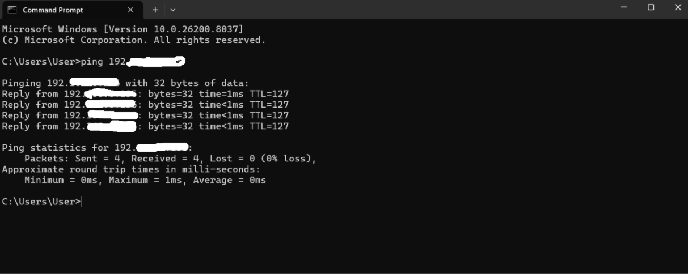

### Step 2: Generate the Deployment Script

1. Log into the Wazuh Dashboard.
2. Navigate to **Wazuh → Add Agent**.
3. Select **Windows**, enter the Wazuh VM's IP address, and copy the generated PowerShell command.

>
>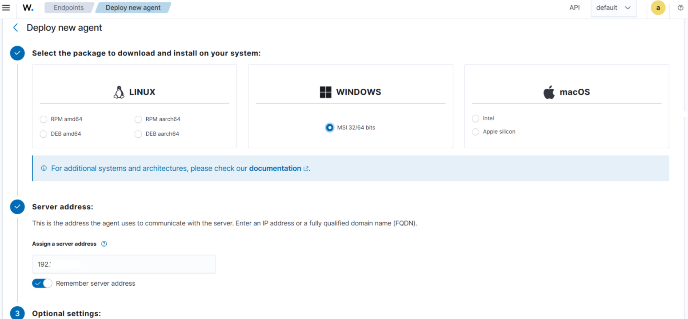

### Step 3: Install and Start on Windows

1. Open **PowerShell as Administrator** on your Windows machine.
2. Paste and run the copied script to silently install the agent.
3. Start the agent background service and set it to run automatically on Windows boot:

```powershell
NET START WazuhSvc
Set-Service -Name WazuhSvc -StartupType Automatic
```

>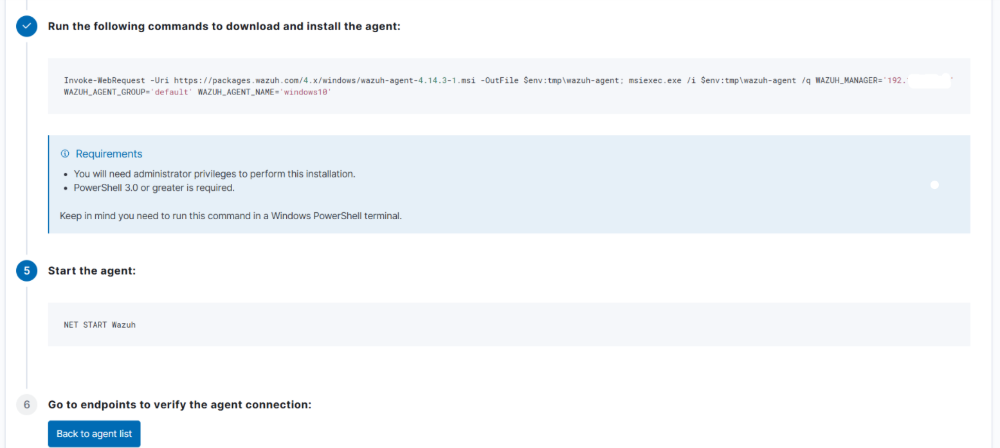
>
> 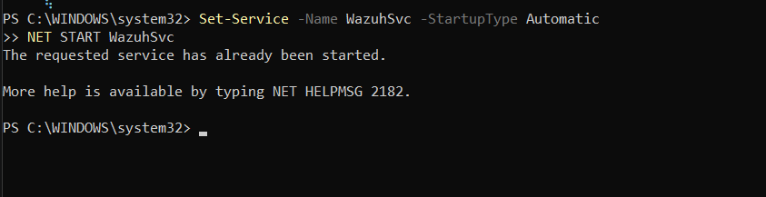


>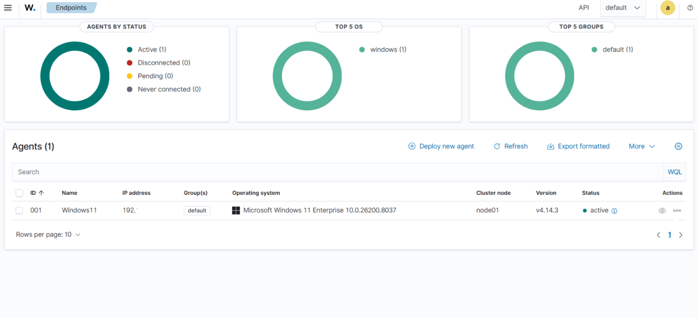

---

## 🔧 Troubleshooting Windows Agent Connectivity

If the dashboard reports **"Agent registered but not connected"**, the initial handshake succeeded (Port 1515), but the log data pipeline failed (Port 1514).

### 1. Test the Data Pipeline

Check if your Windows machine can reach the log ingestion port:

```powershell
Test-NetConnection -ComputerName <YOUR_VM_IP> -Port 1514
```


> 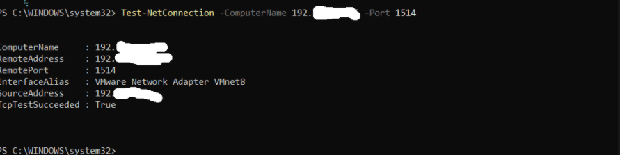

*(If this returns `False`, check if your Windows Defender Firewall is blocking outbound traffic).*

### 2. Force a Reconnect

```powershell
Restart-Service -Name WazuhSvc
```

### 3. Check Agent Internal Logs for Errors

Open **Notepad as Administrator** and read the bottom lines of:

```
C:\Program Files (x86)\ossec-agent\ossec.log
```

---

> Documented for home lab engineering, digital forensics, and SOC infrastructure setups.
